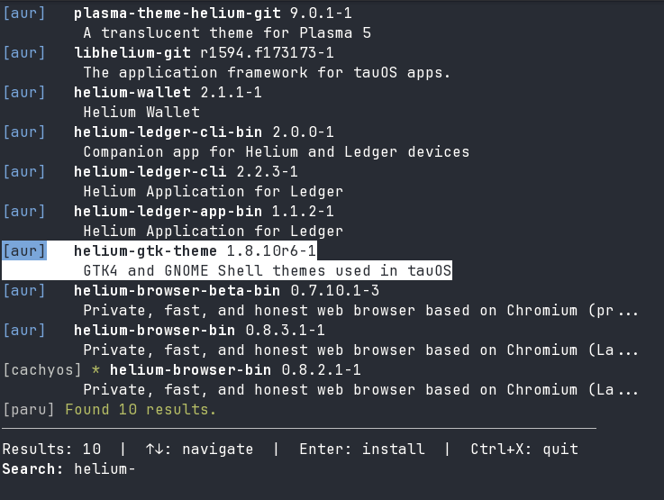

# paclook

A universal interactive package CLI search tool.



## Supported Providers

- **apk** - Alpine Linux package manager
- **apt** - Debian/Ubuntu package manager
- **brew** - Homebrew (macOS/Linux)
- **dnf** - Fedora/RHEL package manager
- **pacman** - Official Arch Linux repos
- **paru** - AUR helper (official repos + AUR)
- **xbps** - Void Linux package manager
- **yay** - AUR helper (official repos + AUR)
- **zypper** - openSUSE package manager


More providers can be added in a modular manner.

## Building from source

```bash
mkdir build && cd build
cmake ..
make -j$(nproc)
```

For static linking (portable binary):
```bash
cmake -DSTATIC_LIBC=ON ..
make -j$(nproc)
```

## Usage

```bash
./paclook                   # Auto-detect best available provider
./paclook -p pacman         # Use specific provider
./paclook -l                # List available providers
./paclook -h                # Show help
```

## Controls

| Key | Action |
|-----|--------|
| Type | Search for packages |
| Up/Down | Navigate results |
| PgUp/PgDn | Navigate by page |
| Enter | Install selected package |
| Escape | Clear search |
| Ctrl+X | Quit |

## Testing with Docker

First install docker for your specific machine, on Arch:

```bash
sudo pacman -S docker
sudo systemctl enable --now docker
sudo usermod -aG docker $USER
newgrp docker  # or logout/login for group to take effect
```

Then run the docker testing scripts to start an interactive session with `paclook` built from source:

```bash
./docker/test.sh alpine    # Alpine (apk)
./docker/test.sh arch      # Arch Linux (pacman, paru, yay)
./docker/test.sh fedora    # Fedora (dnf)
./docker/test.sh homebrew  # Linuxbrew (brew)
./docker/test.sh opensuse  # openSUSE (zypper)
./docker/test.sh ubuntu    # Ubuntu (apt)
./docker/test.sh void      # Void Linux (xbps)
```

## Adding New Providers

1. Create `src/providers/yourprovider.hpp` and `.cpp`
2. Inherit from `Provider` base class
3. Implement: `name()`, `is_available()`, `search()`, `install_command()`
4. Register in `app.cpp`: `create_provider()` and `get_available_providers()`
